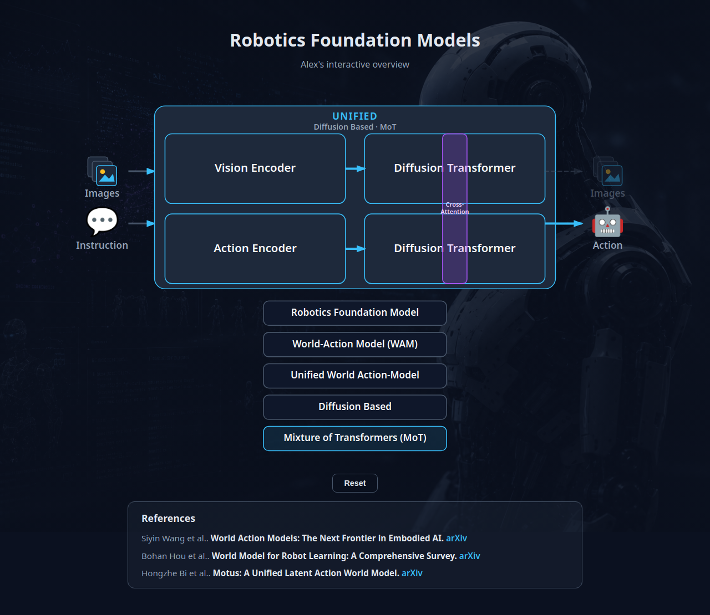

# Robotics Foundation Models — Interactive Overview

An vibe-coded interactive overview of robotics foundation model architectures.
You start with a single "Robotics Foundation Model" rectangle and click your way
into the details. This is the first demo layer; visual polish and deeper layers
come later.



*Example: Unified → Diffusion Based → Mixture of Transformers (MoT), with the Motus reference shown.*

**Live demo:** https://aol-work.github.io/robotics-model-overview/

## Tech stack

- [Vite](https://vite.dev/) + [React](https://react.dev/) + TypeScript
- SVG for the shapes (crisp, easy hover/click, trivial to split rectangles)

## Getting started

```bash
npm install
npm run dev      # start the local dev server (http://localhost:5173)
npm run build    # type-check + produce static assets in dist/
npm run preview  # preview the production build (open the /robotics-model-overview/ path)
```

Pushes to `master` run lint, build, and deploy `dist/` to GitHub Pages via Actions.

The `dist/` output is fully static and can be hosted on any static host
(GitHub Pages, Netlify, Cloudflare Pages, etc.).

## Editing the copy

All user-facing strings live in a single file so wording can change without
touching component logic:

- [`src/content/strings.ts`](src/content/strings.ts)
